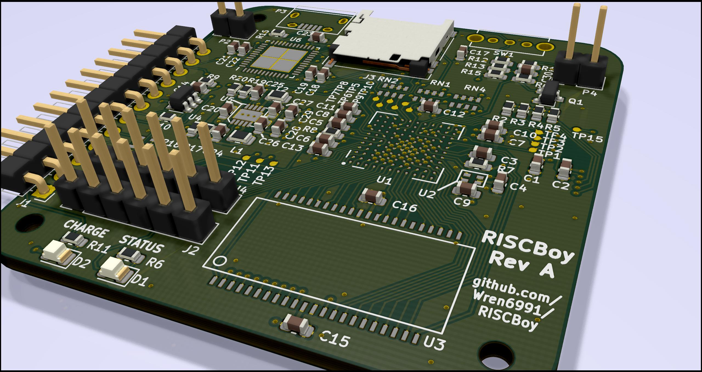

RISCBoy
=======

RISCBoy is an open-source portable games console, designed from scratch. This includes:

- A RISC-V compatible CPU
- A simple graphics pipeline (on the level of a Gameboy Advance) and display controller
- Other chip infrastructure: busfabric, memory controllers, UART, GPIO etc.
- A PCB layout in KiCad


The design is written in synthesisable Verilog 2001, and is intended to fit onto an iCE40-HX8k FPGA. This is the largest FPGA targetable by the open-source iCEStorm FPGA toolchain, but is still fairly austere (7680 LUT4s and flipflops), so some compromises are needed to squeeze our logic in.

More detailed information can be found in the [documentation](doc/fpgaboy_doc.pdf). Please note that, whilst development is in an early stage, this document describes the project in past or present tense, so that I don't have to rewrite it later.

Building RV32IC Toolchain
-------------------------

Follow the instructions on the [RISC-V GNU Toolchain GitHub](https://github.com/riscv/riscv-gnu-toolchain), except for the configure line:

```
./configure --prefix=/opt/riscv --with-arch=rv32ic --with-abi=ilp32
sudo mkdir /opt/riscv
sudo chown $(whoami) /opt/riscv
make -j $(nproc)
```

Simulation
----------

The simulation flow is driven by Xilinx ISIM 14.x; makefiles are found in the scripts/ folder. This has only been tested with the Linux version of ISIM.

You will also need to checkout the RISC-V compliance suite in order to run these tests (note the `-- test` is required to stop git from looking in the KiCad directories and complaining about the library structure there."

```
git submodule update --init --recursive -- test
```

Once this is ready, you should be able to do the following:

```
. sourceme
cd test
./runtests
```

which will run all of the HDL-level tests. Software tests will require the RV32IC toolchain. You may need to adjust some of the paths in `sourceme` if ISIM is installed in a non-default location. To graphically debug a test, run its makefile directly:

```
cd system
make TEST=helloworld gui
```

PCB
---

The PCB is still a work in progress. It should be compatible with iTead's 4-layer 5x5 cm prototyping service, which currently costs $65 for 10 boards.



To meet these specifications, the BGA pads under the FPGA must be tiny, to leave room for interstitial vias between pads.

 - Pitch: 0.8 mm
 - Diagonal pitch: 0.8 * √2 = 1.131 mm
 - Via occupation: minimum drill (0.3) + 2 * minimum OAR (0.15) + 2 * minimum clearance (0.15) = 0.9 mm
 - Pad size: 0.23 mm

This will require soldering by hand with a heat gun and a lot of flux; toaster ovens aren't going to cut it. It's still not clear whether this will work out.

The schematic can be viewed [here (pdf)](board/fpgaboy.pdf)
